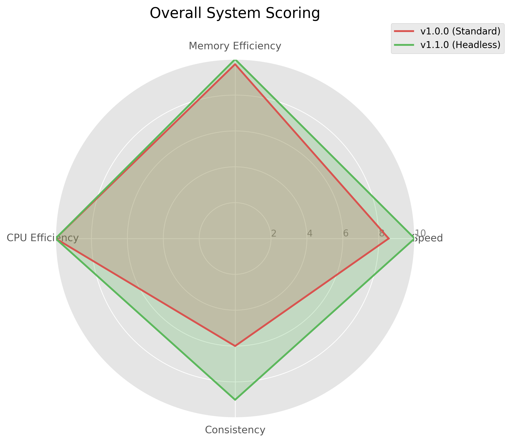
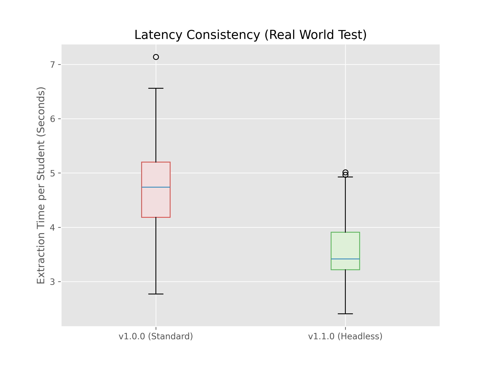
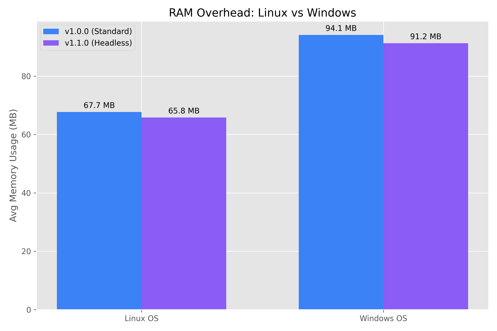
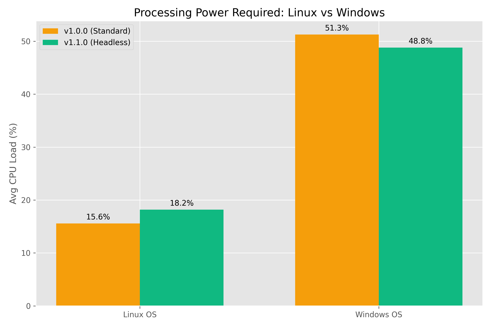
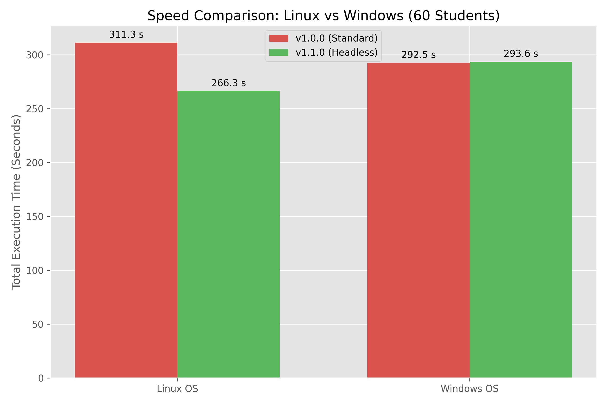
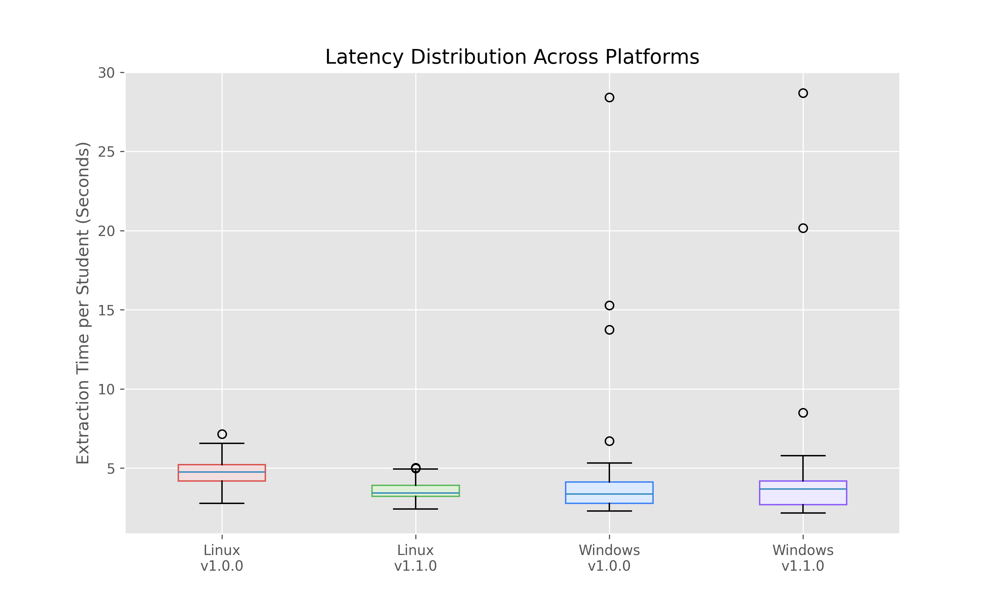

# 📊 ResultSync Performance Benchmarks

This document details the performance profiling of **ResultSync**, covering both architectural optimizations (v1.0.0 vs v1.1.0) and cross-platform behavioral differences (Linux vs. Windows).

All benchmarks were conducted using a real-world dataset of 60 MDU student records, with hardware metrics (CPU, RAM) tracked dynamically via `psutil`.

---

## 🚀 What's New in v1.1.0 (Latest Release)

Version 1.1.0 brings massive performance upgrades and quality-of-life UI improvements:

* **Headless Mode Integration:** Bypasses the browser UI rendering, resulting in significantly faster extraction times and lower system overhead.
* **Auto-Open Excel Toggle:** Added a UI switch to automatically launch the completed Excel report upon finishing.
* **Real-time Progress Tracking:** Improved the progress bar and estimated time calculations.

## 📊 Detailed Performance Comparison (v1.0.0 Standard vs v1.1.0 Headless)

To validate the efficiency of the new architecture, we conducted a rigorous real-world benchmark using a sample size of 60 students. By integrating a tracking function directly into the software, we captured 100% authentic system metrics.

Here is the comprehensive breakdown of the improvements in version v1.1.0.

### 1. Overall System Matrix

**Description:** This radar chart presents a holistic, relative score of both versions across four key metrics. A perfect 10 represents the winner in that category.
* **Analysis:** v1.1.0 forms a dominant triangle at the outer edge, proving it is the superior version. The "Consistency" and "Speed" metrics show the most significant gains, while CPU and Memory efficiency are also notably improved.

***

### 2. Physical Resource Usage Comparison

**Description:** A direct look at the hardware impact and processing speed based on real logged data.
* **Memory Usage:** By not having to render Chrome's graphical interface, v1.1.0 shaves off significant RAM overhead.
* **Avg Latency:** The extraction time *per student* is cut significantly, allowing for much faster batch processing.
* **CPU Load:** Background execution requires less processing power, leaving more resources available for other tasks on your computer.

***

### 3. Scalability (Execution Time Over Data Size)

**Description:** This chart takes the averages from the 60-student test and extrapolates how the total execution time (in minutes) would grow with larger datasets.
* **Analysis:** While v1.0.0 shows an aggressive, steep curve as data sizes increase, v1.1.0 maintains a significantly flatter trajectory. For large-scale university result processing, v1.1.0 will save hours of wait time.

***

### 4. Processing Consistency (Seconds Per Student)

**Description:** This boxplot shows the *variance* in extraction speed for individual students. The "box" represents where most extraction times fall.
* **Analysis:** Version v1.0.0 is very inconsistent, with times spread out and many outliers (the dots representing a single student taking a very long time due to a slow browser render). Version v1.1.0 shows a very tight, compact box and far fewer outliers. This proves that the headless architecture provides a much more stable and predictable processing speed.

---

## Part 2: Cross-Platform Analysis (Linux vs. Windows)

During our testing, we discovered that Selenium WebDriver and Google Chrome exhibit drastically different resource footprints depending on the host Operating System. Here is how Linux compares directly to Windows when running the exact same ResultSync scripts.

### 1. Memory (RAM) Consumption

Linux is significantly more efficient at managing the Chrome WebDriver processes.

* **Linux:** Averages ~65-67 MB of RAM.
* **Windows:** Consumes almost 40% more memory, averaging ~91-94 MB.
  

### 2. CPU Efficiency

Windows requires substantially more processing power to execute the web scraping tasks.

* **Linux:** Maintains a smooth, consistent CPU load between 15% - 20%.
* **Windows:** Averages around 45% - 50% CPU load, with massive individual spikes hitting up to 100% during specific extraction cycles.
  

### 3. Execution Speed & The Headless Anomaly

* **Linux:** Reacts exactly as expected to optimizations. Headless mode (v1.1.0) cut the total execution time from 311 seconds down to 266 seconds.
* **Windows:** Interestingly, Headless mode did not yield a total time speedup on Windows (both hovering around 292 seconds). The OS overhead of managing the hidden background window negated the rendering time saved.
  

### 4. Latency Distribution

The variance in how long it takes to process a single student record.

* **Linux:** Shows a tightly packed distribution, meaning processing times are highly predictable and consistent.
* **Windows:** Exhibits a much wider spread with severe outliers (students that took an unusually long time to process due to OS-level resource blocking).
  

---

## 💡 Conclusion & Recommendations

1. **Update to v1.1.0:** Users on any platform should use v1.1.0 (Headless Mode) to save RAM and prevent the browser from interrupting their workflow.
2. **Platform Recommendation:** For extracting extremely large batches of university results (1000+ students), running ResultSync on a **Linux** environment is highly recommended due to its superior memory management and CPU efficiency.
