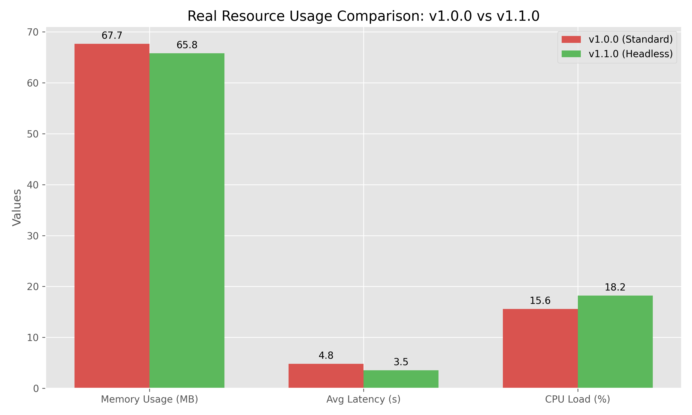
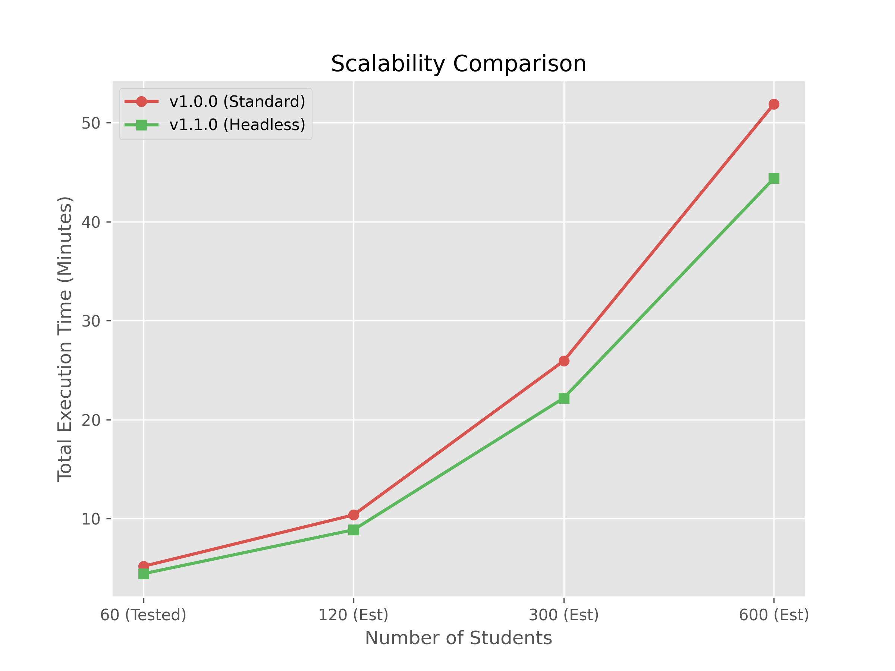

# Result Sync

## Overview

Result Sync is a Python-based GUI application designed to automate the extraction of BCA (Bachelor of Computer Applications) examination results from the Maharshi Dayananda University (MDU) result portal. The application uses web scraping techniques to fetch individual student results and compiles them into a formatted Excel report. This tool is particularly useful for educators, administrators, or students who need to process multiple result records efficiently.

**Author:** Raju Yadav
**Copyright:** ©2025 Raju Yadav
**Powered by:** Python, made with Love ❤

## 🚀 What's New in v1.1.0 (Latest Release)

Version 1.1.0 brings massive performance upgrades and quality-of-life UI improvements:

* **Headless Mode Integration:** Bypasses the browser UI rendering, resulting in significantly faster extraction times and lower system overhead.
* **Auto-Open Excel Toggle:** Added a UI switch to automatically launch the completed Excel report upon finishing.
* **Real-time Progress Tracking:** Improved the progress bar and estimated time calculations.

## 📊 Detailed Performance Comparison (v1.0.0 Standard vs v1.1.0 Headless)

To validate the efficiency of the new architecture, we conducted a rigorous real-world benchmark using a sample size of 60 students. By integrating a tracking function directly into the software, we captured 100% authentic system metrics.

Here is the comprehensive breakdown of the improvements in version v1.1.0.

### 1. Overall System Matrix


**Description:** This radar chart presents a holistic, relative score of both versions across four key metrics. A perfect 10 represents the winner in that category.
* **Analysis:** v1.1.0 forms a dominant triangle at the outer edge, proving it is the superior version. The "Consistency" and "Speed" metrics show the most significant gains, while CPU and Memory efficiency are also notably improved.

***

### 2. Physical Resource Usage Comparison



**Description:** A direct look at the hardware impact and processing speed based on real logged data.
* **Memory Usage:** By not having to render Chrome's graphical interface, v1.1.0 shaves off significant RAM overhead.
* **Avg Latency:** The extraction time *per student* is cut significantly, allowing for much faster batch processing.
* **CPU Load:** Background execution requires less processing power, leaving more resources available for other tasks on your computer.

***

### 3. Scalability (Execution Time Over Data Size)



**Description:** This chart takes the averages from the 60-student test and extrapolates how the total execution time (in minutes) would grow with larger datasets.
* **Analysis:** While v1.0.0 shows an aggressive, steep curve as data sizes increase, v1.1.0 maintains a significantly flatter trajectory. For large-scale university result processing, v1.1.0 will save hours of wait time.

***

### 4. Processing Consistency (Seconds Per Student)


**Description:** This boxplot shows the *variance* in extraction speed for individual students. The "box" represents where most extraction times fall.
* **Analysis:** Version v1.0.0 is very inconsistent, with times spread out and many outliers (the dots representing a single student taking a very long time due to a slow browser render). Version v1.1.0 shows a very tight, compact box and far fewer outliers. This proves that the headless architecture provides a much more stable and predictable processing speed.

## Features

- **User-Friendly GUI:** Built with CustomTkinter for a modern, responsive interface.
- **Automated Web Scraping:** Utilizes Selenium to interact with the MDU result portal and extract data.
- **Excel Integration:** Reads student records from an input Excel file and writes results to an output Excel file with professional formatting.
- **Progress Tracking:** Real-time progress bar and status updates during processing.
- **Error Handling:** Robust error handling with resume capability and user notifications.
- **Threading:** Prevents GUI freezing by running the extraction process in a separate thread.
- **Feedback System:** Includes a link for user feedback to improve the User Exeprience.

## Requirements

### System Requirements

- **Operating System:** Windows, macOS, or Linux (tested on Linux)
- **Python Version:** Python 3.7 or higher
- **Browser:** Microsoft Edge (required for Selenium WebDriver)
- **Internet Connection:** Required for accessing the MDU result portal

### Python Libraries

The following libraries must be installed:

- `customtkinter` - For the GUI interface
- `openpyxl` - For Excel file handling
- `selenium` - For web automation
- `pillow` (PIL) - For image processing (used for icons)
- `threading` - Built-in Python module
- `os` - Built-in Python module
- `tkinter` - Built-in Python module (usually comes with Python)

## Installation

### Step 1: Install Python

Ensure Python 3.7+ is installed on your system. Download from [python.org](https://www.python.org/downloads/).

### Step 2: Install Required Libraries

Open a terminal/command prompt and run the following commands:

```bash
pip install customtkinter
pip install openpyxl
pip install selenium
pip install pillow
```

### Step 3: Install Google Chrome

If not already installed, download and install Google Chrome from .

### Step 4: Download the Project

Clone or download the project files to your local machine.

## Usage

### Preparing Input Data

1. Create an Excel file (.xlsx) with student records.
2. The first row must be headers.
3. Column A: Registration Number
4. Column B: Roll Number
5. Save the file in .xlsx format.

### Running the Application

1. Navigate to the project directory in your terminal.
2. Run the application:
3. The GUI window will open.

### Step-by-Step Procedure

1. **Launch the App:** Run the script as described above. The main window titled "Result Sync" will appear.
2. **Select Input File:**
   * In the "Required Info" frame, click the folder icon next to "Select Record File (.xlsx)".
   * Choose your prepared Excel file containing student registration and roll numbers.
   * The file path will be displayed in the text box.
3. **Select Output Location:**
   * Click the folder icon next to "Location to Save".
   * Choose where to save the output Excel file and provide a filename (e.g., "BCA_Results_2026.xlsx").
   * The save path will be displayed in the text box.
4. **Proceed:**
   * Click the "Proceed" button.
   * The app will validate the inputs and display a progress bar, percentage, and estimated time.
5. **Start Processing:**
   * Click the "Start" button.
   * The application will begin extracting results from the MDU portal.
   * Monitor the progress bar and current student status.
   * The process may take several minutes depending on the number of records.
6. **Completion:**
   * Once finished, a success message will appear.
   * The output Excel file will contain formatted results with student details, marks, and pass/fail status.

### Output Format

The generated Excel file includes:

* **Title:** "BCA Result" (merged cells A1:N1)
* **Section Headers:** Student Details, Marks in Each Subjects, Result
* **Columns:** Sr.No, Name, Father Name, Registration No, Roll No, (empty), sub_1, sub_2, sub_3, sub_4, sub_5, (empty), Total Marks, Result
* Professional formatting with colors and fonts.

## Important Notes & Legal Disclaimer

* **Data Format:** Ensure the input Excel file has registration numbers in column A and roll numbers in column B, starting from row 2 (row 1 is headers).
* **Error Handling:** If an error occurs during processing, the app will save progress and display an error message. You may need to reselect the output file and restart.
* **Resume Capability:** The app tracks processed entries and can resume from where it left off if interrupted.
* **Browser Compatibility:** Currently configured for Google Chrome.
* **⚠️ Legal Notice:** This is an independent tool strictly for educational and personal utility. It is not affiliated with MDU. Ensure compliance with MDU's terms of service. Do not use this tool to overload the servers (DDoS) or extract data without proper authorization. Use at your own risk.

## Troubleshooting

* **File Not Found:** Verify the input file path and ensure the file exists.
* **WebDriver Issues:** Ensure Google Chrome is installed and up-to-date. Selenium handles WebDriver automatically.
* **Permission Errors:** Ensure the output Excel file is closed before clicking Start.
* **GUI Freezing:** The app uses threading to prevent freezing, but very large datasets may still take time.

## License

This project is licensed under the MIT License. See the `LICENSE` file for details.

## Feedback

Your feedback is valuable! Click the "Click Here" link in the app or visit the provided Google Form.

## Contributing

For contributions or modifications, please contact the author.

## Changelog

* **v1.1.0:** Added Headless Chrome mode for optimized performance, added Auto-Open file toggle, improved progress tracking, and added automated hardware benchmarking tools.
* **v1.0.0:** Initial release with core functionality for BCA result extraction.
